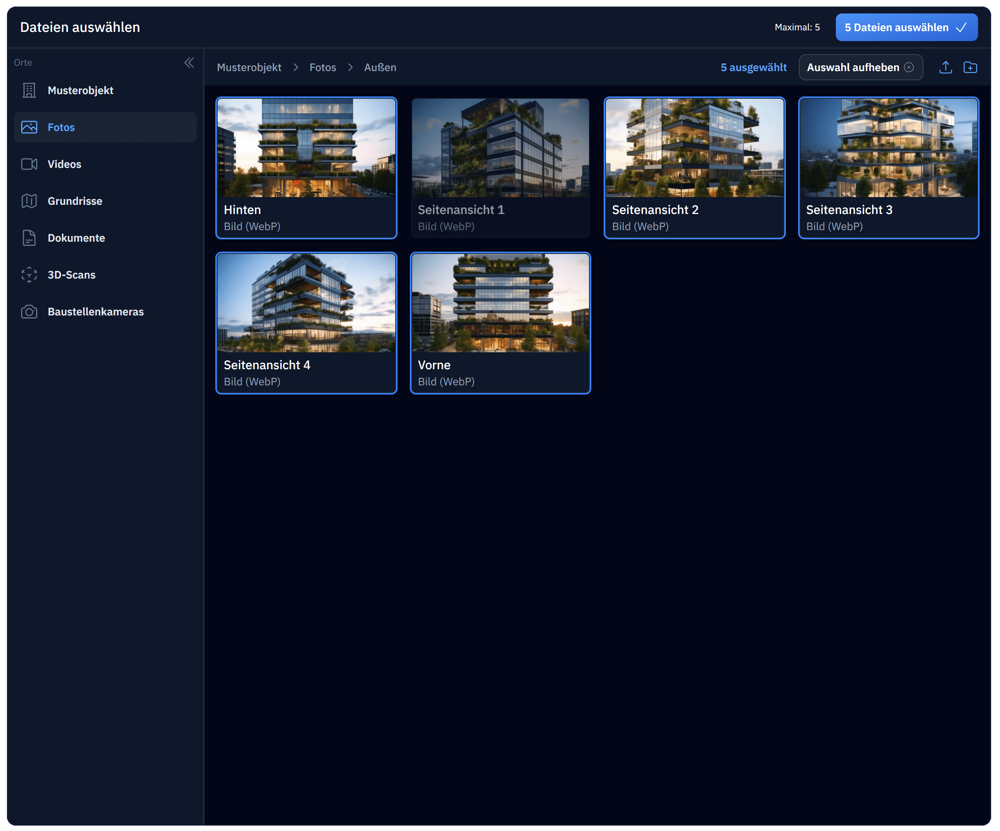
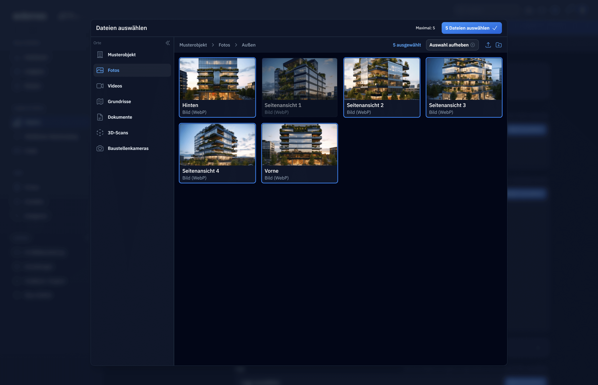
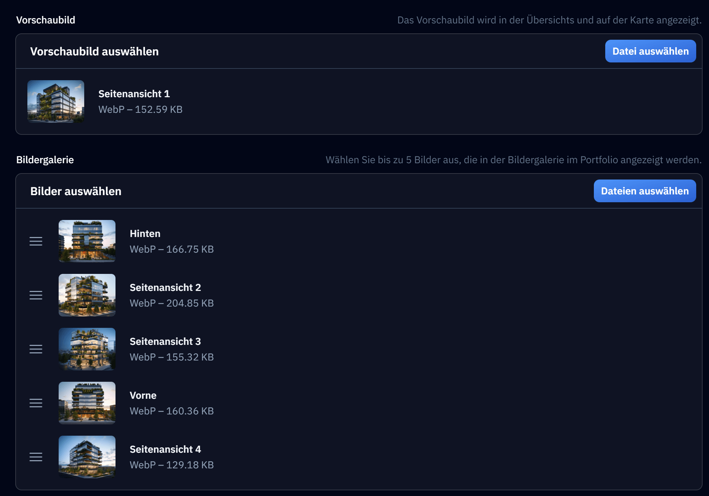
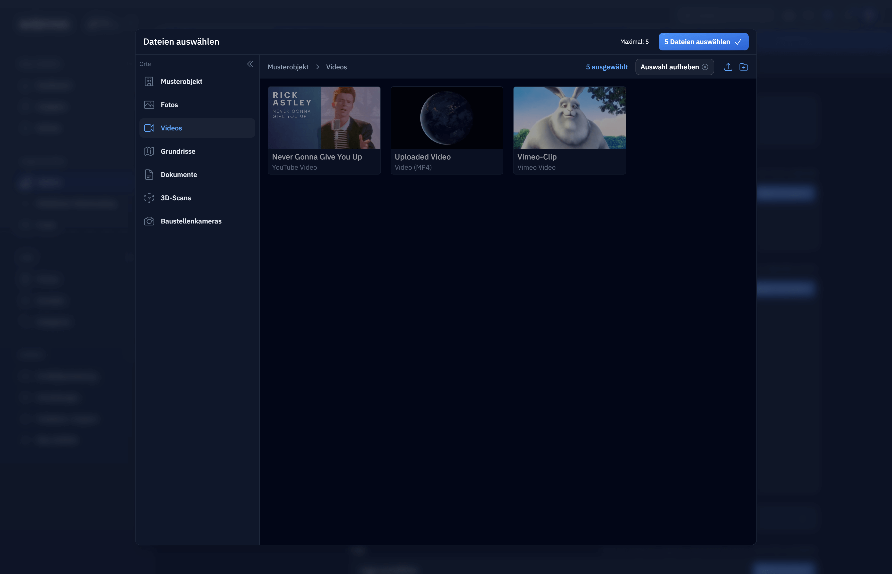
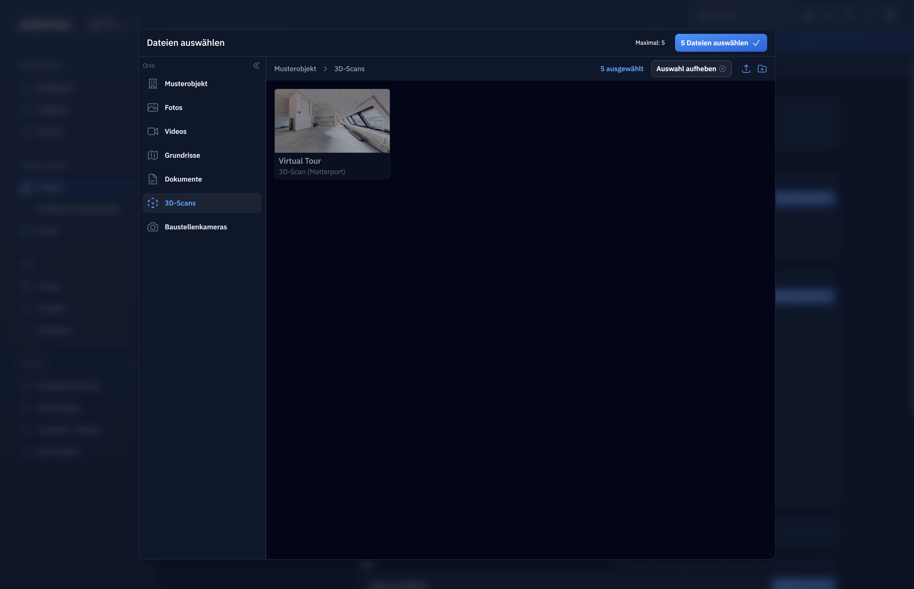
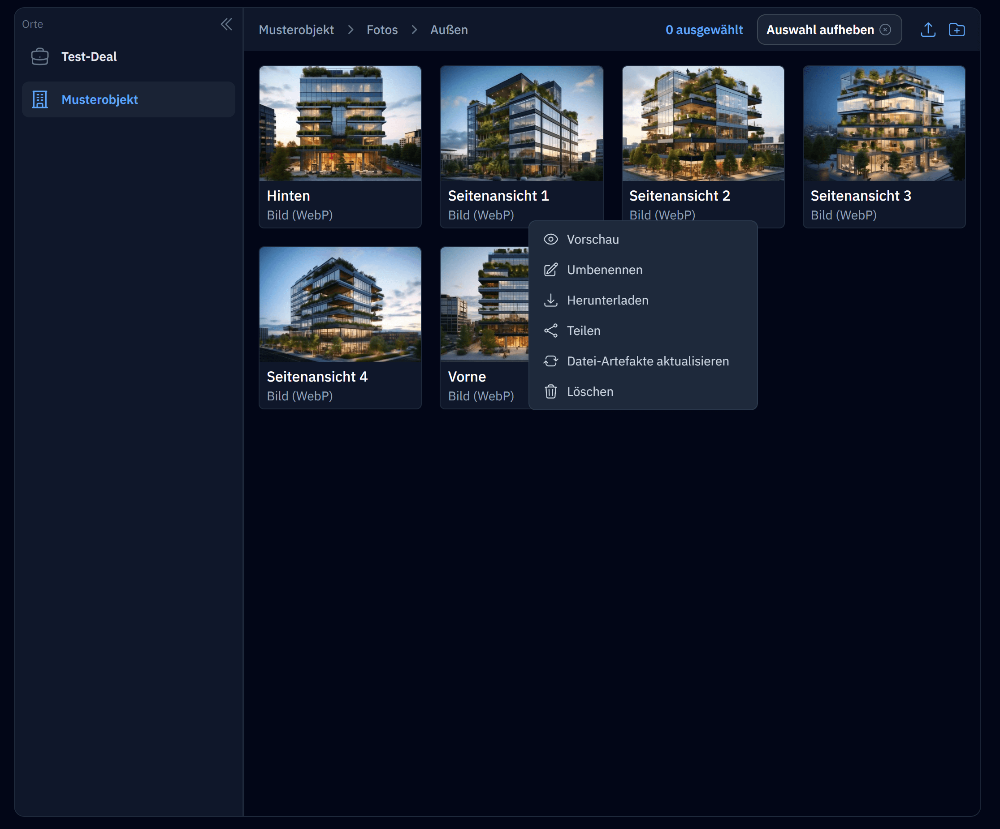
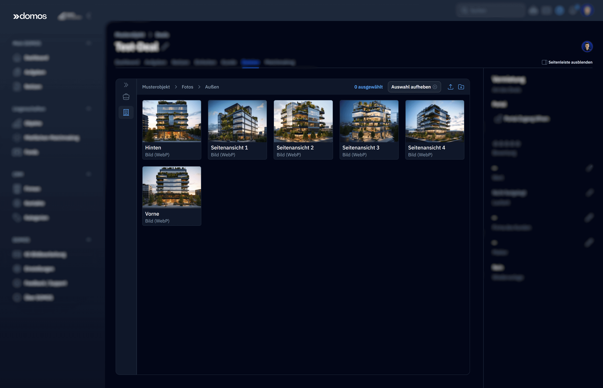

<div align="center">
    
	<h1>Laravel Cabinet</h1>
    	<h3>Turn-key file management solution, supporting multiple sources in the same folders</h3>
<!-- 	<div>
		<a 
			href="https://github.com/Capevace/cabinet/actions/workflows/test.yml"
		>
			
		</a>
		<a href="https://github.com/Capevace/cabinet/actions/workflows/test.yml">
			
		</a>
		
	</div> -->
	<h6><em>Made by <a href="https://mateffy.me">Lukas Mateffy</a></em></h6><br><br>

</div>
<br />


<p><strong>Cabinet is a turn-key file management solution for Laravel, that enables uploading and managing files, as well as attaching files to models. 
It integrates various file sources into a streamlined API and user interface (including disks, spatie/media-library, 
custom database tables, external APIs and anything you can think of, basically).</strong></p>

<br><br>

> [!NOTE]  
> Cabinet is currently 0.x and considered "unstable". While it's API has not changed in months and is already used in production ([domos.de](https://domos.de)), the API may still be 
> subject to change. Planned release for version 1.0 and thus semver API stability is end of May 2024.

<br><br>

<details open>
  <summary><h2>Screenshots</h2></summary>

  <table>
	  <tr>
		  <td width="70%">
			  
		  </td>
		  <td>
			  <h4>Finder popup to mamage and select files</h4>
			  <p>Your application code just sets some parameters, like what file types are allowed, how many files are selected and what directory to open.</p>
		  </td>
	  </tr>
	  <tr>
		  <td width="70%">
			  
		  </td>
		  <td>
			  <h4>Supports creating and nesting folders and customizing the sidebar</h4>
		  </td>
	  </tr>
	  <tr>
		  <td width="70%">
			  
		  </td>
		  <td>
			  <h4>Pre-built file inputs for <a href="https://filamentphp.com/">Filament Forms</a></h4>
		  </td>
	  </tr>
	  <tr>
		  <td width="70%">
			  
		  </td>
		  <td>
			  <h4>Supports showing multiple file types/sources in the same folder/view</h4>
			  <p>In this case, we can show an uploaded video (S3) right next to an "uploaded" YouTube/Vimeo video (added by URL). They share the combined file type <code>Video([mime-type])</code> which simplifies the code that uses the selected files, and they can still be differentiated using their mime-type. Thumbnails are either generated for local files (in this case using <a href="https://spatie.be/docs/laravel-medialibrary/v11/introduction">spatie/media-library</a> as a backend) or fetched from the actual YouTube/Vimeo thumbnail URLs.</p>
		  </td>
	  </tr>
	  <tr>
		  <td width="70%">
			  
		  </td>
		  <td>
			  <h4>Supports real files and non-files</h4>
			  <p>Here we use the <a href="https://matterport.com/">Matterport</a> API to add virtual scans/tours that only exist as an API resource, not singular files. In our application code however, we can just treat it as if it was a file. It has a custom (user-land) file type <code>VirtualScan</code>.</p>
		  </td>
	  </tr>
	  <tr>
		  <td width="70%">
			  
		  </td>
		  <td>
			  <h4>Supports a custom context menu</h4>
		  </td>
	  </tr>
	  <tr>
		  <td width="70%">
			  
		  </td>
		  <td>
			  <h4>Embeddable Finder Livewire component</h4>
			  <p>By assigning whole directories to your models, you can have encapsulated file management for single models. For example, manage contract documents for a Deal/Project CRM-like, media assets for CMS pages etc...</p>
		  </td>
	  </tr>
  </table>
</details>

<br><br>

<br>

## Motivation

While building an application, I needed a solution to make uploaded files browsable and selectable inside a 
"Project"-like resource. 

I needed a unified way to manage both uploadable files and "virtual files" that aren't files in the 
traditional sense, but still make sense to be selectable in a Finder-like view. For example it makes sense to be able to
select a 3D-Scan of a building in the same way as a floor plan or its photo, even though the scan is only 
accessible via API and is only referenced via custom table in our app.

**Cabinet** is the solution I came up with that allows to manage files from different sources in a single, unified way.

<br><br>

## How it works

File management is complicated! So in order to use Cabinet, it helps to have a basic understanding of how it works.
Cabinet is built around the concept of **sources**, **folders**, **files**, **file types** and **file references**.

### Sources

A **source** is a class that is responsible for listing and managing files. Sources will return a list of files for a given folder
and can resolve file data for a given file identifier. Sources can read/write data from anywhere, from a disk, a 
database table, or an external API.

When querying files for a folder, Cabinet will query multiple sources and merge the results. This allows you to display
many different types of files in a single view.

To create a source, Cabinet provides a `Source` interface that needs to be implemented. Sources can then support additional
features, such as uploading, deleting, etc. by implementing additional interfaces (`AcceptsUploads`, `AcceptsData`, etc.).
[Learn more about creating sources](#creating-sources).

### Folders

Folders are a way to organize files. Folders can be nested and can contain files and other folders. Folders are
managed by Cabinet itself and are stored in the `cabinet:directories` database table, using the `Directory` model.
(We use "Directory" for the raw model / DB data and "Folder" throughout the rest of the code, in order to be able to
differentiate between the two).

### Files

A `File` is a unified data structure that represents a file. It contains the file's metadata, such as its name, size,
and file type. It also contains everything required to resolve the file's data: its source the file's identifier.
These can be used to access a file's URL or its contents by calling the associated source through Cabinet.

### File types

A `FileType` is a class that is responsible for determining the type of a file. Cabinet comes with a few built-in file
types, such as `Image`, `Video`, `Audio`, `Document`, etc. These file types unify many different file extensions and
mime types into a single type. For example, the `Image` file type will match all image files, such as `.jpg`, `.png`,
`.gif`, etc. and will also match the `image/jpeg`, `image/png`, `image/gif` mime types.

This makes it much easier to deal with files, as you don't have to worry about all the different file extensions and
mime types. You can simply check if a file is an `Image` and Cabinet will take care of the rest. However,
you can can still access the file's raw mime type and extension if you want to limit selection / uploads.

You can also create your own file types for your custom models by implementing the `FileType` interface. 
[Learn more about creating file types](#creating-file-types) or look at some [examples](#built-in-file-types).

### File references

A `FileRef` is a model that is used to reference a file from a model. It uses a polymorphic relationship to reference
the model to attach files to and stores the file's ID and source in order to retrieve it. This allows you to attach 
files to any model in your application without needing pivot tables or other complex structures. However, `FileRef`'s 
have a UUID and nullable model columns, so you can also use your foreign key constraints if you want to create stronger
couplings.  

It also stores the name of the relationship that is used to access the file. This allows you to attach multiple different
files to a model, such as a thumbnail and a gallery, without having to worry about naming conflicts.

In addition, it also contains an order column, which allows saving multiple files in a specific order under a single
relationship.


## Installation 

The following command will install the cabinet core package and the UI package. The pre-built UI is made with [Filament](https://filamentphp.com) and is technically optional, but recommended.

```bash
composer require capevace/cabinet capevace/cabinet-ui
```

If you want to completely build your own UI and just use Cabinet headlessly, you can omit the `capevace/cabinet-ui` package.

### Run the install command to publish the config and migrations

Cabinet requires two tables to be present in your database. You can publish the migrations and config file using the following command:

```bash
php artisan cabinet:install
```

You're all done! You can now start using Cabinet.

<br><br>

## Getting started

To demonstrate how Cabinet works, we'll build an example model that places a thumbnail and image gallery on a `Post` model.

### 1. Add `HasFiles` and `InteractsWithFiles` to your model

In order for a model to be able to have files attached to it, it needs to implement the `HasFiles` interface, which can be done by using the `InteractsWithFiles` trait.

```php
use Capevace\Cabinet\Concerns\InteractsWithFiles;
use Capevace\Cabinet\Contracts\HasFiles;

class Post extends Model implements HasFiles
{
    use InteractsWithFiles;
    
    // ...
}
```

### 2. Define the file relationships

Next, we need to define the file relationships on the model. We'll add a `thumbnail` and `gallery` relationship to our `Post` model.

See [Defining file relationships](#defining-file-relationships) for more information.

```php
use Capevace\Cabinet\Concerns\InteractsWithFiles;
use Capevace\Cabinet\Contracts\HasFiles;

class Post extends Model implements HasFiles
{
    use InteractsWithFiles;
    
    public function thumbnail()
    {
        // Single file
        return $this->fileRef('thumbnail');
    }
    
    public function gallery_images()
    {
        // Multiple files
        return $this->fileRefs('gallery_images');
    }
}
```

### 3. Uploading files to Cabinet

Now that we have our model set up, we can start uploading files to Cabinet. This can be done in two ways:

1. Using the Cabinet UI `Finder` component
2. Manually, using the `Cabinet` facade

#### Using the Cabinet UI

The Cabinet UI comes with a `Finder` component that can be used to upload manage files within Cabinet. This component can be included in any view using the `x-cabinet-finder` Blade component.

```blade
@props(['folderId' => null])

{{-- The folderId determines the folder that is opened and the "root" of this view --}}
<x-cabinet::finder
    :folder-id="$folder->id"
/>
```

#### Manually, using the `Cabinet` facade

You can also upload files manually by specifying the file source and providing the required data.
For normal files (e.g. with spatie/media-library, etc.), this will be a `TemporaryUploadedFile` instance, 
which Laravel provides when uploading files. For virtual files, this will be an array of data.

```php
use \Cabinet\Facades\Cabinet;

$folder = Cabinet::folder('<my-folder-uuid>');

$uploadedFile = request()->file('thumbnail');

// Upload a normal file
$file = Cabinet::getSource('spatie-media')
    ->upload($folder, $uploadedFile);

// Upload a virtual file
$file = Cabinet::getSource('youtube-videos')
    ->add($folder, 'Rick Astley - Never Gonna Give You Up (Video)', [
        'id' => 'dQw4w9WgXcQ',
    ]);
```

### 4. Attach files to the model

Your models are now ready to have files attached to them. You can attach either attach files manually, or use the Cabinet UI to do so (this requires using [Filament forms](https://filamentphp.com)) .

#### Using the Cabinet UI

The Cabinet UI provides a `FileInput` [Filament form component](https://filamentphp.com) that can be used to attach 
files to models. You can use this component by adding it to your form schema like so:

```php
use \Livewire\Component;
use \Livewire\Attributes\Computed;
use \Filament\Forms\Contracts\HasForms;
use \Filament\Forms\Form;

use \Cabinet\Filament\Components\FileInput;

class PostForm extends Component implements HasForms
{
    public string $postId;
    
    #[Computed]
    public function post(): Post
    {
        return Post::findOrFail($this->postId);
    }
    
    public static function form(Form $form)
    {
        return $form
            ->model($this->post)
            ->schema([
                // ...

                FileInput::make('thumbnail')
                    ->label('Thumbnail')
                    // The `relationship` method will automatically attach the file
                    // to the model when saved
                    ->relationship('thumbnail')
                    // The amount of files that can be picked
                    ->single()
                    // This specifies the root folder that will be opened in the file picker
                    ->root('<my-folder-uuid>'),
                    
                FileInput::make('gallery_images')
                    ->label('Gallery Images')
                    // It is also possible to attach multiple files
                    ->relationship('gallery_images')
                    ->max(5)
                    ->root('<my-folder-uuid>'),
                    
                // ...
            ]);
    }
    
    public function save()
    {
        $data = $this->form->getState();
        
        $this->post->update($data);
        
        // This will attach the files to the model
        $this->form->saveRelationships();
    }
}
```

#### Attaching files via code

If you're not using Filament in your app or you want to attach files in other places, you can also attach files manually using the `Cabinet` facade.

```php
use \Cabinet\Facades\Cabinet;

$post = Post::find(1);

$file = Cabinet::file('spatie-media', '5');

// Attach a single file
Cabinet::attach($file, to: $post, as: 'thumbnail');

// or directly via the relationship (we're "create"-ing a FileRef)
$post->thumbnail()->create($file->getReferenceData());

// Attach multiple files
Cabinet::attach($files, to: $post, as: 'gallery_images');
```

<br><br>

## Concepts

## Accessing Folders
```php
$directory = Cabinet::directory($id);
// -> Directory

$folder = Cabinet::folder($id);
// -> Folder
// same as $directory->asFolder();
```

## Referencing Files
```php

$ref = Cabinet::reference($file);

auth()->user()->update([
	'avatar_file_ref_id' => $ref->id,
]);


Cabinet::attach($file, to: auth()->user(), as: 'avatar');


```

## Accessing Files
```php
$filesAndFolders = $folder->list();
// -> Collection<File|Folder>

$files = $folder->files();
// -> Collection<File>

$folders = $folder->folders();
// -> Collection<Folder>

// Create a File DTO via source model ID
$file = Cabinet::file('spatie-media', '5');
// -> Cabinet\File {#1618
//     id: "5",
//     source: "spatie-media",
//     type: Cabinet\Types\Image {#1629},
//     name: "yoda",
//     slug: "yoda.png",
//     mimeType: "image/png",
//     size: 6566715,
//     url: "https://v3.test/storage/5/yoda.png",
// }

// Create a File DTO via source path and disk
$file = Cabinet::file($source, 'avatars/test.png', disk: 'local');
```

## Renaming Files
```php
// Will rename the file to "Hello there", the underlying file will be named 'hello-there-custom.png'.
Cabinet::rename($file, 'Hello there');

// Will rename the file to "Hello there", the underlying file will be named 'hello-there-custom.png'.
Cabinet::rename($file, 'Hello there', slug: 'hello-there-custom');

// Will only change the "virtual" filename, not the underlying file
Cabinet::rename($file, 'Hello there', slug: false);
```

## Moving Files
```php
// You can pass either the Folder DTO
Cabinet::move($file, $folder);

// Or the Directory model
Cabinet::move($file, $directory);
```

## Delete Files
```php
Cabinet::delete($file);
```

## Uploading Files

```php
use Illuminate\Http\UploadedFile;

$uploadedFile = new UploadedFile(...);

// Upload to a specific source
$source = Cabinet::getSource('spatie-media')
	->upload($directory || $folder, $uploadedFile);

// or using shorthand syntax
Cabinet::upload('spatie-media', $folder, $uploadedFile);
```
